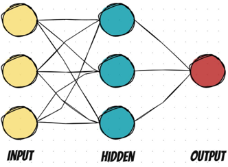
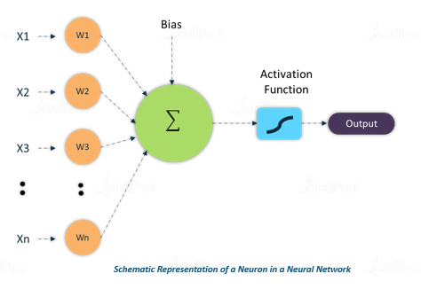
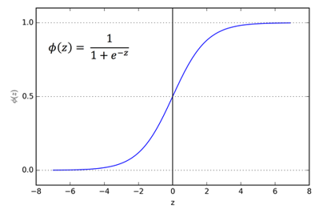
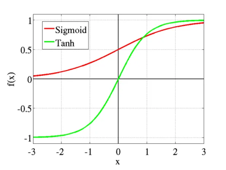
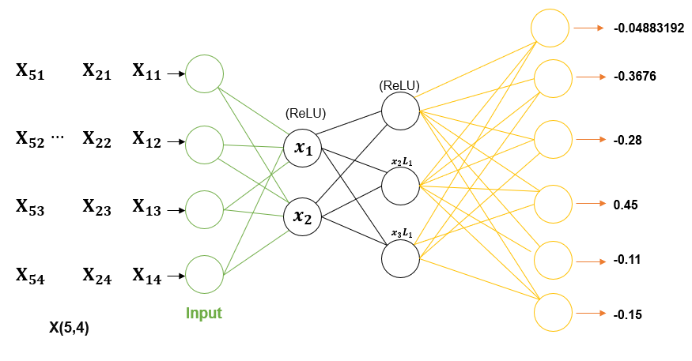
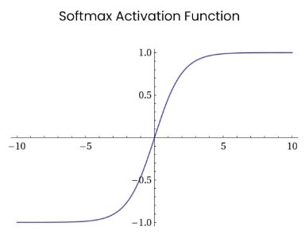
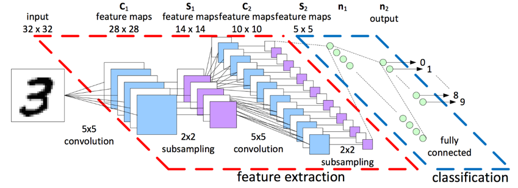

# **The Neural Network**

## Architecture ของ Neural Network 

- ในบทเรียนนี้มีทั้งหมด 3 layers และ nodes ใน hidden/ output layers คือ neurons
* Input layer ข้อมูลที่จะส่งเข้ามาใน network ในตัวอย่างนี้มี 3 neurons ทำหน้าที่ส่งข้อมูล (3 neurons = 3 features ใน dataset ที่เราใช้เทรนโมเดล)
* Hidden layer ในตัวอย่างนี้มี 3 neurons (ตัวเลขนี้ arbitrary สามารถปรับได้)
- Output layer ในตัวอย่างนี้มีแค่ 1 neuron ทำหน้าที่ทำนายผล

 

---

## การทำงานของ Neural Network, 

- เริ่มจาก Layers ในส่วนของ Input Layer จะมีจำนวน Neuron เท่ากับขนาดของ Data
- สมมติว่ามีภาพขนาด 32x32 pixels, จำนวนของ Neuronใน Input Layer ก็คือ 1024 หรือ 32x32 Node
พอได้ข้อมูลมาแล้ว แต่ละ Neuron ใน Input Layer ก็จะส่งตัวเลขของ Input ไปให้ Neuron อื่นๆ ใน Layer ต่อไป หรือใน ANN จะเรียกว่า Hidden Layer
- ในแต่ละ Neuron ใน Hidden Layer จะมีสิ่งที่เรียกว่า Activation Function เพื่อ Transform ค่าทุกค่า ที่ได้รับมาจากทุกๆ Node ใน Layer ก่อนหน้า เพื่อส่งต่อไปยัง Layer ต่อไป
- ก่อนที่ทุกๆค่าจะเข้า Activation Function จะต้องมีการถ่วงน้ำหนักของค่าแต่ละค่าก่อน หรือ Weight จะได้ในมารูป (xᵢ x wᵢ) หรือ (Input x Weight)
- Weight ตอนเริ่มต้นของ แต่ละ Input จะเป็นแบบสุ่ม, และค่อยๆเปลี่ยนแปลงไปเรื่อยๆ เพื่อให้ Fit กับ Data พอถ่วงน้ำหนักเรียบร้อย จะนำแต่ละค่าที่ถูกถ่วงน้ำหนักมารวมกัน(Sum) และเข้า Activation Function เพื่อ Transform ให้ออกมาเป็นค่า Output และส่งไปยัง Neuron ต่อไป

 

- จากภาพ จะมีสิ่งที่เรียกว่า Bias จะเป็นตัวแปรที่เข้าไป (+) หรือ (-) ค่าที่ได้หลังจากรวมรวมค่าทุกๆค่าก่อนจะเข้า Activation Function ซึ่งมันจะส่งผลให้ตัว Activation Function เลื่อนไปซ้ายหรือขวา นั่นก็หมายความว่า ค่า Output ที่ได้หลังจากผ่าน Activation Function จะเปลี่ยนแปลงไปตาม Bias ด้วย

        *ตัวอย่าง

        - ใช้ ReLU เป็น Activation Function แล้วค่า Weighted Sum ที่ได้หลังจากรวม(Input x Weight) ทุกค่าแล้ว เท่ากับ (-0.35) แน่นอนว่า ReLU(-0.35) = 0
        - นั่นก็หมายความว่า Node นี้จะไม่ทำงาน ซึ่งมันอาจจะส่งผลดีหรือผลเสียต่อตัว Network หรือเปล่าก็ไม่ทราบ
        - แต่ที่มี Bias มา ก็เพื่อมาเปลี่ยนแปลงค่าของ Weighted Sum หรือ (-0.35) ที่ได้มา
        - สมมติว่า Bias = 1 , จะได้ว่า ReLU(-0.35 + 1) = ReLU(0.65) = 0.65
        - ก็หมายความว่า Node นี้ที่มี Bias = 1 และ Weighted Sum = -0.35
        - จะส่งค่า 0.65 ออกมา, หมายความว่า Node นี้จะทำงาน และส่งค่า 0.65 ไปให้ Node อื่นต่อๆไป

---

## Activation Function

    หน้าที่ของ Activation function คือการควบคุม Output ของ Neuron ให้อยู่ใน Range ที่ Neuron ชั้นถัดไปจะคำนวนได้ง่าย และถ้าหาก Activation นั้นอยู่ใน Hidden layer ชั้นสุดท้าย ก็จะมีหน้าที่ควบคุม Range ของ Output ให้สามารถตีความเป็นคำตอบได้ง่าย 

## 1. Sigmoid Function

    Sigmoid Function เป็นฟังก์ชันที่เป็น Curve รูปตัว S เห็นแล้วเข้าใจได้ง่าย และเนื่องจาก Output ของ Sigmoid Function มีค่าระหว่าง 0 – 1 จึงเหมาะที่จะถูกใช้ในงานที่ต้องการ Output เป็นความน่าจะเป็น (Probability) หรือใช้เป็น Output ว่า 1=Yes, 0=No 

 

## 2. Tanh OR Hyperbolic Tangent Function

    หน้าตาจะคล้ายกับ Sigmoid แต่ output ของมันคือ (-1 จนถึง 1) ซึ่ง sigmoid คือ (0 จนถึง 1) จุดเด่นของฟังก์ชั่นนี้คือถ้าค่าที่ได้ออกมาเป็นค่าติดลบก็จะมีแนวโน้มไป maps กับค่าที่เป็นลบสูง โดยถ้าค่าเป็น 0 ก็จะมีแนวโน้มไป maps กับค่าใกล้ๆ 0 ในกราฟสูงมาก tanh function ถูกนิยมนำไปใช้กับ classification ที่มี 2 คลาส

## 3. ReLU Function

    เป็นฟังก์ชั่นที่ได้รับความนิยมสูงสุดที่ในโลกขณะนี้ นิยมใช้ใน Convolutional Neural Network หรือ Deep Learning ถ้าดูจากกราฟ ReLU จะมีแค่ครึ่งเดียว โดยที่ถ้าค่าต่ำกว่า 0 จะได้ output เป็น 0 โดยทันที หากค่ามากกว่าหรือเท่ากับ 0 ก็จะได้ output ที่มากกว่า 0 นั้นเอง
    Range: [ 0 to infinity]

## 4. Softmax Function 

    หรือ SoftArgMax Function หรือ Normalized Exponential Function คือ ฟังก์ชันที่รับ Input เป็น Vector ของ Logit จำนวนจริง แล้ว Normalize ออกมาเป็นความน่าจะเป็น Probability ที่ผลรวมเท่ากับ 1
    Softmax ถูกนำไปใช้บ่อย ในงาน Classification จนถึงขนาดมีคนเรียกว่า Softmax Classifier หรือ Softmax Loss

---

## ผังงานโครงข่าย CNN (การทำ Convolutional)

- จากรูปภาพข้างต้น สามารถอธิบายได้ดังนี้

        INPUT: คือชั้นนำเข้า จะถูกกำหนดให้รูปภาพที่นำมาใช้ในการเรียนรู้มีขนาด 32x32 pixel
        Layer C1: คือชั้นคอนโวลูชัน (Convolutional Layer) ที่กำหนดให้มี Feature Map จำนวน 6 ชั้น โดยขนาดของ Feature Map กำหนดให้เป็น 28x28 pixel
        Layer S1: คือ Sub-Sampling Layer ที่กำหนดให้ Feature Map มีจำนวน 6 ชั้น และกำหนดให้มีขนาด 14x14 pixel
        Layer C2: คือชั้นคอนโวลูชันที่กำหนดให้มี Feature Map จำนวน 16 ชั้น โดยขนาดของ Feature Map กำหนดให้เป็น 10x10 pixel
        Layer S2: คือ Sub-Sampling Layer ที่กำหนดให้ Feature Map มีขนาด 16 ชั้น โดยขนาดของ Feature Map กำหนดให้เป็น 5x5 pixel 
        Layer n1: ประกอบด้วย 84 unit และทำหน้าที่เชื่อมกับชั้น S2 แบบ Fully-Connected
        n2 OUTPUT: ชั้นแสดงผลลัพธ์ ในชั้นนี้จะนำ Layer n1 ที่ประกอบด้วย 84 unit มาคำนวณด้วยวิธี Euclidean Radial Basis Function units (RBF) เพื่อหาคำตอบของแต่ละ Unit (Output Layer ประกอบด้วย 10 unit)

--------
