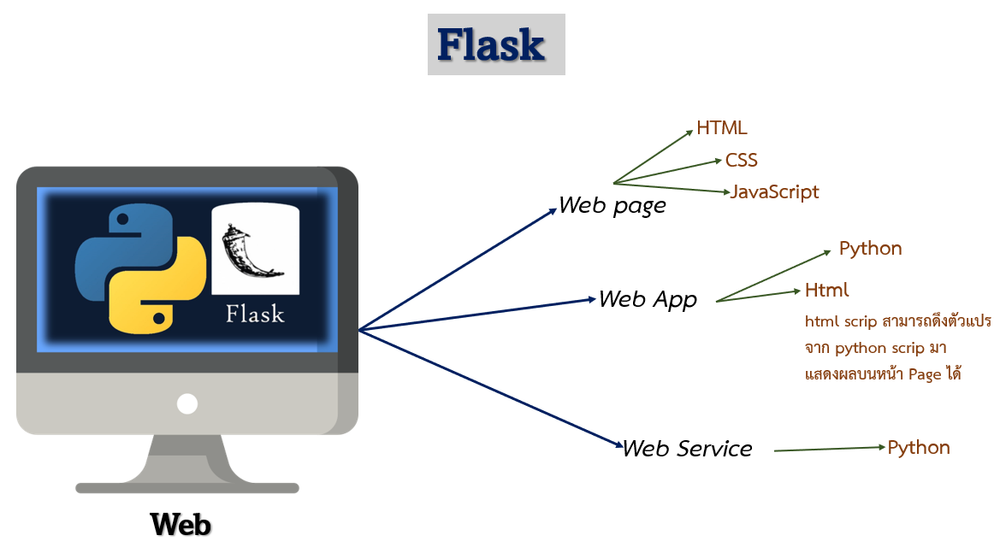
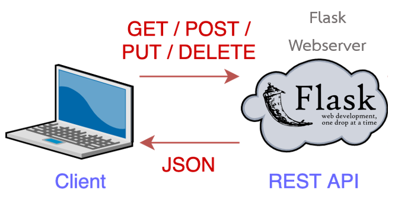

# **Developing RESTful APIs with Python and Flask**

Flask คือ Micro web framework ที่เขียนด้วยภาษา Python โดย Flask ถูกจัดให้อยู่ใน Microframework เพราะไม่ต้องการใช้เครื่องมือหรือ Library เฉพาะ ดังนั้น จึงมีแค่เครื่องมือที่จำเป็น เลยทำให้มีขนาดเล็ก แต่เขียนโค้ดไม่กี่บรรทัดก็สามารถใช้ได้ทันที Flask ไม่มีทั้ง Database หรือการตรวจแบบฟอร์ม (Form validation) แต่ยังรองรับ Extensions ที่ช่วยเพิ่มความสามารถอื่นได้ ถ้ามันรองรับการใช้กับ Flask

 

## **Flask HTTP methods, handle GET & POST requests**

<!-- Use html table because github markdown doesn't support colspan -->
<table>
  <tr>
    <td colspan="2" align="center"><b>Flask HTTP methods</b></td>
  </tr>
  <tr>
    <td align="center">Request</td>
    <td align="center">Purpose</td>
  </tr>
    <td align="center">GET</td>
    <td align="left">เมธอดนี้ Client ทำการร้องขอข้อมูล (Request) เข้ามา โดยสามารถอ่านหรือดูข้อมูลใน Resources นั้นได้อย่างเดียว จะไม่สามารถทำอะไรให้ Resources เกิดการเปลี่ยนแปลงของข้อมูลได้ ถ้ามีการร้องขอข้อมูลเข้ามา แล้ว Match กับ Resources ที่มีอยู่ ตัวเว็บเซิร์ฟเวอร์ก็จะรีเทิร์น STATUS 200 เพื่อบอกว่ามีการเรียกดูข้อมูลใน Resources สำเร็จ หรือถ้าข้อมูลใน Resources นี้ไม่มีหรือถูกลบออกไปแล้ว ก็จะรีเทิร์น STATUS 404 Not Found เป็นต้น </td>
</tr>
    <td align="center">POST</td>
    <td align="left">เมธอดนี้ Client สามารถบันทึกหรือทำให้ Resource ของผมเกิดการเปลี่ยนแปลงได้ เช่นเพิ่มข้อมูล ตัวอย่างง่าย ๆ เช่นอย่างการบันทึกข้อมูลในฟอร์ม เมื่อเราเข้าไปเว็บของ Lazada แล้วต้องการสั่งซื้อสินค้า จากนั้นเราก็กรอกข้อมูลการชำระเงินต่าง ๆ นั่นแหละคือเมธอด POST เมื่อข้อมูลที่เรากรอกถูก Submit ตัวเว็บเซิร์ฟเวอร์จะรีเทิร์น STATUS 201 เพื่อบอกว่ามีการสร้างข้อมูลใหม่เข้ามาใน Resources ซึ่งเมื่อสังเกตดูที่ url ที่เว็บบราวเซอร์ เราจะไม่เห็นข้อมูลหรือพารามิเตอร์ต่าง ๆ ก็จะถูกซ่อนไว้ ซึ่งถ้าเป็นเมธอด GET ข้อมูลเหล่านั้นจะแสดงออกมาให้เห็นหมด ดังนั้นถ้ามีการทำ Transaction ต่าง ๆ ที่ต้องมีการบันทึกข้อมูล จึงควรต้องใช้เมธอด POST </td>
</tr>
    <td align="center">PUT</td>
    <td align="left">เมธอดนี้ Clients สามารถแก้ไขหรืออัพเดตข้อมูล ใน Resources ได้ เมื่ออัพเดตข้อมูลสำเร็จ เว็บเซิร์ฟเวอร์ก็จะรีเทิร์น STATUS 200</td>
</tr>
    <td align="center">DELETE</td>
    <td align="left">เมธอดนี้ Clients สามารถลบข้อมูลใน Resources ได้ ซึ่งสมมติว่ามีการลบข้อมูลออกไปแล้วโดยเมธอด DELETE นี้ เมื่อเข้ามาที่ url เดิม ก็จะพบกับ STATUS 404 Not Found</td>
</tr>
</table>

---

```
Rest API จะทำงานอยู่บนโปรโตคอล HTTP/HTTPS (ที่เราใช้กันปกติในการสื่อสารบน web browser) โดยที่การทำงานของมันก็จะมีการใช้งานผ่าน method ต่างๆ และการสื่อสารก็มักจะทำโดยผ่านชุดข้อมูลที่มี format เป็น JSON อีกทั้งในการสื่อสารแต่ละครั้งโดยส่วนใหญ่ก็จะมีการพ่วง status code กลับไปด้วยเพื่อบอกว่าการทำงานของมันเป็นไปได้สมบูรณ์หรือไม่
```

 


